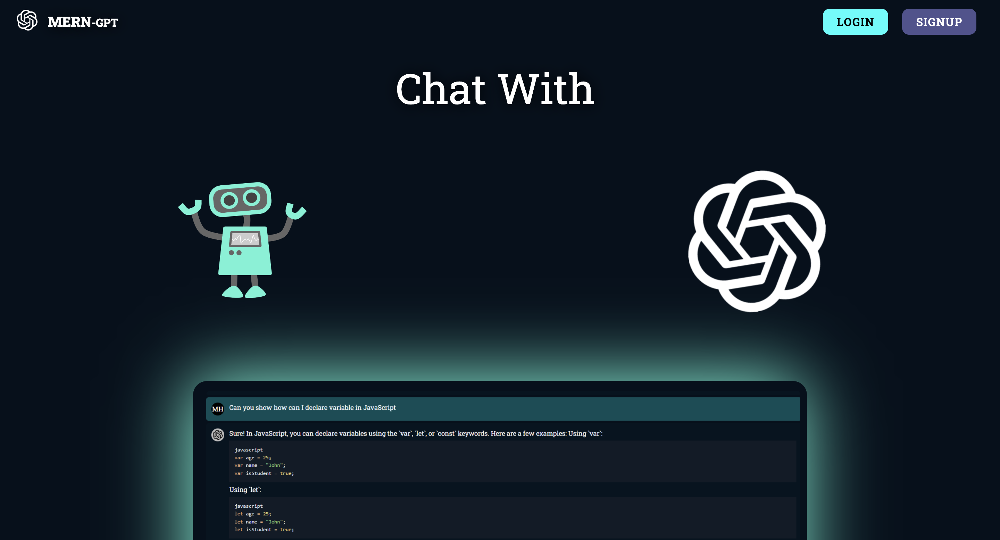
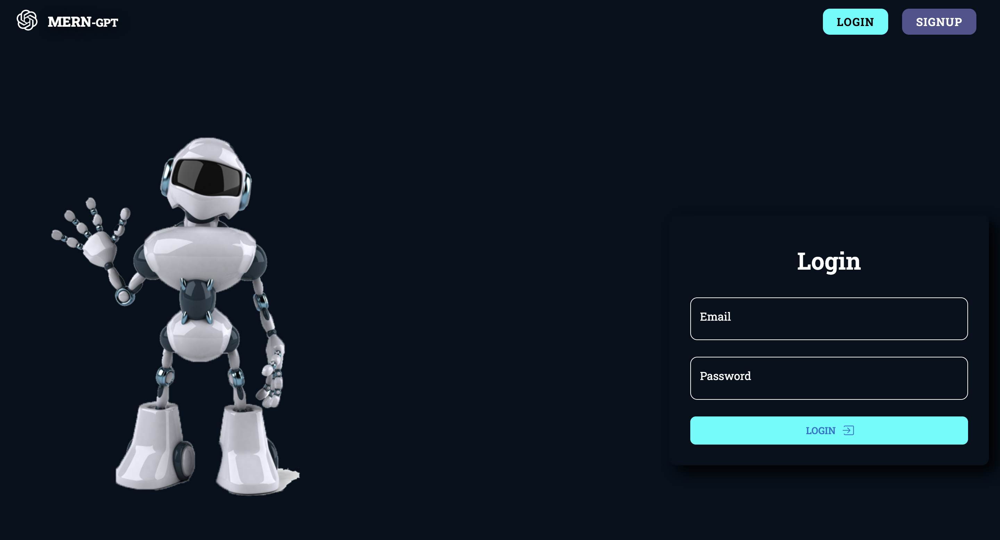
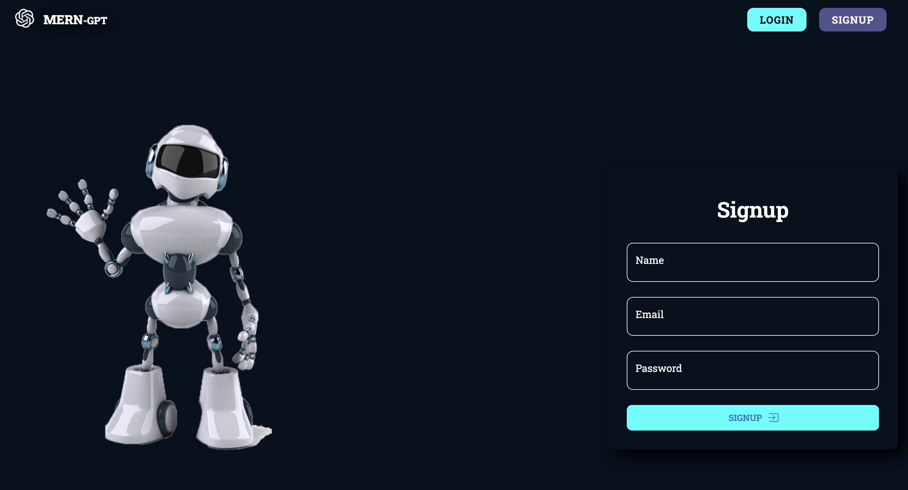
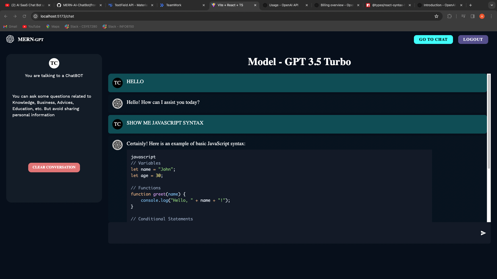

# MERN-GPT

Welcome to the MERN-GPT project! This comprehensive course guides you through building a secure and scalable AI chatbot using the MERN (MongoDB, Express, React, Node.js) stack with advanced authentication. The project provodes a deep understanding of an advanced, secure, and production-ready SaaS application.

## Key Features

- **MERN Stack Deep Guide**: In-depth exploration of MongoDB, Express, React, and Node.js.
- **User Authentication and Authorization System**: Create a robust user authentication and authorization system.
- **Express-Validators Middleware**: Implement data validation middleware using the express-validator library.
- **MongoDB Integration**: Store user's chats in MongoDB, defining models and schema.
- **JWT Authorization Tokens**: Use JSON Web Tokens for secure authorization and HTTP-only cookies.
- **Protected User Routes**: Implement verification checks to protect user routes.
- **Modern React App with Vite and TypeScript**: Build a modern React app using Vite and TypeScript.
- **Material UI for Beautiful UI**: Create a beautiful chat UI with the Material UI library.
- **Responsive Design**: Ensure a complete and responsive design for a seamless user experience.
- **OpenAI Integration**: Integrate OpenAI with the MERN stack app to enhance chat capabilities.
- **Full Stack ChatGPT Clone**: Develop a full-stack ChatGPT-like clone, including storing user sessions.
- **Cookie-Parser Usage**: Utilize the cookie-parser library for handling cookies in the application.
- **TypeScript**: The entire project is developed using TypeScript for static typing and enhanced code quality.

## Overview

- **Setup and Starting Project**: Set up the project with Node, Express, and TypeScript.
- **REST API with NodeJS and Express**: Created a REST API with Node.js and Express.
- **MongoDB Database Connection**: Establish a connection to the MongoDB database.
- **OpenAI Integration**: Got API keys from OpenAI and set up routes for users and chats.
- **User Authentication and Authorization**: Deep dived into implementing JWT access tokens and HTTP-only cookies.
- **Frontend Setup with React and Vite**: Set up a modern React app with Vite and Typescript.
- **Material UI Customization**: Customized Material UI theme and design the app's header.
- **User Interface Design**: Designed login, chat, and signup UI screens.
- **Integration with OpenAI**: Integrated OpenAI with Node.js application for chat completion.
- **Protected Routes and Logout**: Added protected routes, logout functionality, and other user-related features.
- **Homepage UI Design**: Designed the homepage UI with typing animation and images rotation.
- **TypeScript**: The entire project is developed using TypeScript for static typing and enhanced code quality.
- **Full Stack ChatGPT Clone**: Developed a full-stack ChatGPT-like clone, including storing user sessions.

## Screenshots

### Landing Page

### Login Page

### Signup Page

### Chat Interface

## Summary

This project provides a comprehensive guide to building a secure and scalable AI chatbot using the MERN stack. 

